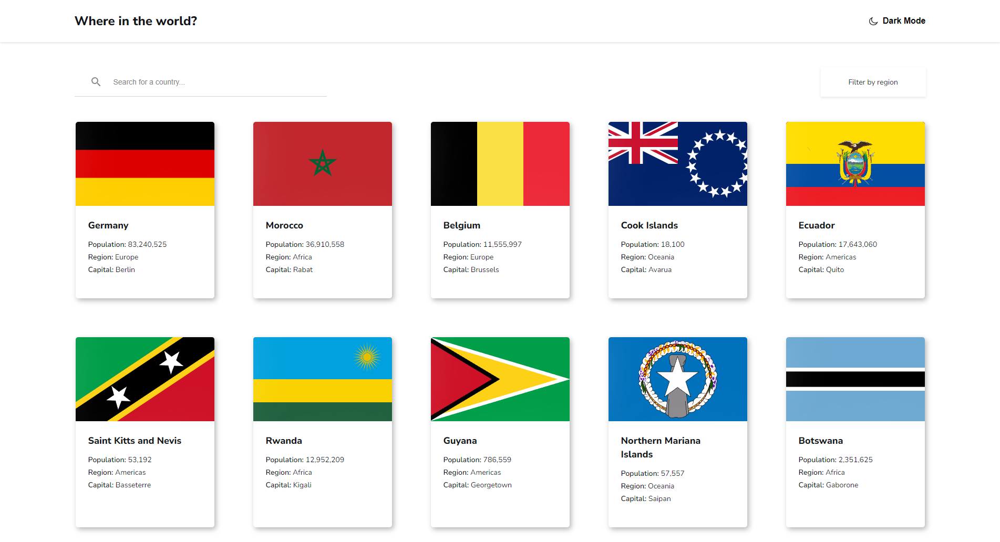

# Frontend Mentor - REST Countries API with color theme switcher solution

This is a solution to the [REST Countries API with color theme switcher challenge on Frontend Mentor](https://www.frontendmentor.io/challenges/rest-countries-api-with-color-theme-switcher-5cacc469fec04111f7b848ca). Frontend Mentor challenges help you improve your coding skills by building realistic projects. 

## Table of contents

- [Overview](#overview)
  - [The challenge](#the-challenge)
  - [Screenshot](#screenshot)
  - [Links](#links)
- [My process](#my-process)
  - [Built with](#built-with)
  - [What I learned](#what-i-learned)
  - [Useful resources](#useful-resources)
- [Author](#author)
- [Acknowledgments](#acknowledgments)

## Overview

### The challenge

Users should be able to:

- See all countries from the API on the homepage
- Search for a country using an `input` field
- Filter countries by region
- Click on a country to see more detailed information on a separate page
- Click through to the border countries on the detail page
- Toggle the color scheme between light and dark mode *(optional)*

### Screenshot




### Links

- Solution URL: [GitHub solution](https://github.com/miroslavdurin/REST-countries)
- Live Site URL: [REST Countries](https://restcountries-mdurin.netlify.app)

## My process

### Built with

- Semantic HTML5 markup
- CSS custom properties
- SASS/SCSS
- BEM methodology
- Flexbox
- CSS Grid
- [Axios](https://axios-http.com/docs/intro) - Promise based HTTP client for the browser and node.js
- [React](https://reactjs.org/) - JS library
- [Context API](https://reactjs.org/docs/context.html) - State management system for React
- [React Router v6](https://reactrouter.com/docs/en/v6/getting-started/overview) -  Routing library for React
- [Framer Motion](https://www.framer.com/docs/) - Animation library for React


### What I learned

The main thing I've learned were basics of using Context API. There were also some challenges with displaying dynamic values in JSX.
I have also improved my knowledge on using Framer Motion library, mainly layout animations, which were tricky to make.

The main issue which I had, happened after I started to animate route transitions with Framer Motion. For some reason it had collided 
somehow with Context API, but I've solved that by writing this code:

```js
<Routes location={location.pathname === '/' ? location.location : location} key={location.key}>
```
There was also a problem with animating Details components. I've noticed that if the image was loaded for the first time, sometimes 
animation didn't happened. I managed to figure out that the cause was the fact that certain images were not loaded in cache, so I've 
Googled the solution for that and found a way to preload images in React:

```js
if(action.payload.neighbours) {
  action.payload.neighbours.forEach(neighbour=>{
    const img = new Image(); 
    img.src = neighbour.flags.svg;            
  })
}
```

### Useful resources

- [Stack Overflow](https://stackoverflow.com) - This helped me with some bugs, mainly with preloading images in React.
- [Framer Motion docs](https://www.framer.com/docs/) - Framer Motion documentation.
- [Lama Dev YT-channel](https://www.youtube.com/c/LamaDev/videos) - This is where I've learned how to use Context API.

## Author

- Frontend Mentor - [@miroslavdurin](https://www.frontendmentor.io/profile/miroslavdurin)
- GitHub - [@miroslavdurin](https://github.com/miroslavdurin)

## Acknowledgments

This project was harder then expected, but I've managed to finish it just the way I intented. The only problem was that it last longer than I expected. I've learned a lot about React, especially how pages are being load in React. There were lots of issues with displaying dynamic data, which doesn't seem to load the way that I've thought it would. Perhaps there was a better way to manage fetched data, but I've managed to make it work.